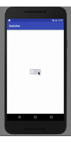

Switcher
======
[](http://bruceboard.me)

A simple switch button for android.  
* change background color in `bgColor` attribute.  
* change slide block color in `floatColor` attribute.  
* add `OnStateChangedListener` to Switcher

Preview
=======


Gradle
======
```
dependencies {
    compile 'com.brucewzp.widget.library:library:0.8.5'
}
```

Maven
=====
```
<dependency>
  <groupId>com.brucewzp.widget.library</groupId>
  <artifactId>library</artifactId>
  <version>0.8.5</version>
  <type>pom</type>
</dependency>
```

License
---

	Licensed under the Apache License, Version 2.0 (the "License");
	you may not use this file except in compliance with the License.
	You may obtain a copy of the License at

	   http://www.apache.org/licenses/LICENSE-2.0

	Unless required by applicable law or agreed to in writing, software
	distributed under the License is distributed on an "AS IS" BASIS,
	WITHOUT WARRANTIES OR CONDITIONS OF ANY KIND, either express or implied.
	See the License for the specific language governing permissions and
	limitations under the License.
